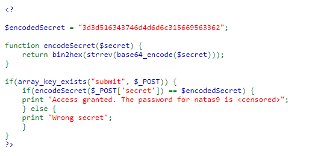

# Natas Level 8 Walkthrough

**URL:** [http://natas8.natas.labs.overthewire.org](http://natas8.natas.labs.overthewire.org)

## Introduction
- Natas Level 8 is a web security challenge.
- The objective is to find the password for the next level, natas9.

## Initial Exploration
1. Open the website using the provided URL.
   

2. Investigate the source code for hints and vulnerabilities.
   

## Decoding the Password
3. You'll notice that the PHP source code contains an encoded password.

4. To decode the password, follow these steps:
   - Copy the encoded password.
   - Open a tool like CyberChef or use a similar method of your choice.
   - Perform the following operations in reverse order:
     - Convert from base64 to obtain a reversed string.
     - Reverse the string to restore the original order.
     - Convert the reversed string from hex.
   

## Success
5. After decoding the password, you'll obtain the password for natas9.
   

